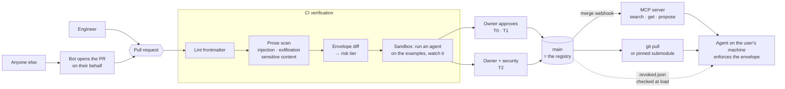

# Forge — skills in a git repo

**Draft HLD v0.7 · 2026-09-11 · dvd** · *"Forge" is a placeholder name.*

**The repo is the registry.** One git repository holds every skill as a markdown file. A skill is
approved by opening a **pull request**; CI runs verification, owners approve, merge publishes.
Engineers consume the skills by cloning the repo. Everyone else reaches the same approved skills
through an **MCP server** that serves them to whatever agent they already use.

This replaces a bespoke registry with infrastructure the org already runs, reviews in, and trusts.
Almost everything a package registry does, git and CI already do:

| Concern | Mechanism | Cost |
|---|---|---|
| Who wrote this | Commit author, signed commits, PR approver | **free** |
| Versioning per skill | The commit that last touched the skill's directory | **free** |
| Immutability | Git objects are content-addressed | **free** |
| Review and approval | Pull request, required approvals, CODEOWNERS | **free** |
| Access control | Repo and directory permissions | **free** |
| Change audit | `git log` | **free** |
| Distribution to engineers | `git pull`, or a pinned submodule | **free** |
| Rollback | `git revert` | **free** |
| **Verification** | CI workflow on every PR | build — small |
| **Distribution to everyone else** | MCP server serving approved skills | build — the main piece |
| **Update push + revocation** | Webhook to the MCP server; a denylist checked at load | build — small |

Three things to build, not a platform.

---

## How it works



**Propose → verify → approve → use.** Everyone lands in the same pull request, whether they wrote
it in git or in a web form. CI runs the cheap checks before the expensive one, and the envelope
diff is what decides whether security has to look. Merging is publishing: the MCP server reloads on
the webhook, engineers pull. Revocation is the one edge that bypasses the flow entirely, because it
has to work on a clone that never pulls again.

---

## Repository

```
skills/
  pagerduty-triage/
    SKILL.md              # the instructions — frontmatter is the manifest
    examples.md           # 3–5 inputs and what a good answer looks like
    references/           # optional supporting docs, loaded on demand
  close-checklist/
    SKILL.md
CODEOWNERS                # per-directory ownership → who must approve
revoked.json              # digests that must stop being served or loaded
.github/workflows/verify.yml
```

One repo, not one per team. Directory-level `CODEOWNERS` gives per-team ownership without repo
sprawl, and keeps a single review pipeline and a single audit point.

**Everyone in the organization has read access; there are no private skills.** Write access stays
gated by PR and CODEOWNERS. This deletes an entire authorization layer — the MCP server needs no
ACLs, search needs no per-user filtering, and there is never a second repo to federate. It also
makes the catalog a commons: the fastest way to learn how another team works becomes reading their
skills.

It costs one hard content rule, enforced in CI: **a skill file is org-public, so it must never
contain customer data, credentials, or anything confidential.** Skills describe *how* to do
something; the data stays in the systems the agent is directed to.

```markdown
---
name: pagerduty-triage
summary: Triage an incident — pull the timeline, correlate deploys, draft a status update.
owners: [sre-platform]
capabilities:                    # what the agent may be asked to do while following this
  network: [api.pagerduty.com]
  files: [workspace-read, scratch-write]
  shell: false
  subskills: [deploy-log]
---

# Triage a PagerDuty incident

1. Fetch the incident timeline from …
```

**The capability block is the load-bearing part.** It is a claim about what the agent will be
asked to do. CI derives the risk tier from it, the sandbox diffs observed behaviour against it, the
MCP server and the local loader enforce it, and it renders as the plain-language consent screen a
non-engineer actually reads: *"your agent may read your project folder and contact
api.pagerduty.com."* Widening it is mechanically detectable, and that is what stops a wording fix
from quietly acquiring network access.

**No secrets in v1.** Skills receive data and return data; anything needing a credential waits.

---

## Contributing

**Engineers** open a PR the way they open any PR.

**Everyone else does not write git.** A recruiter's screening rubric and a controller's close
checklist are the majority of skills in any organization, and requiring `git rebase` would end the
project. So there are two front doors onto the same PR:

- A **web form** (and an equivalent `propose_skill` tool on the MCP server): write or paste the
  markdown, answer a few plain-language questions about what the agent will need to do, submit.
- A bot commits to a branch and **opens the PR on the author's behalf**, attributing them in the
  commit trailer and subscribing them to the PR so review comments reach them by email.

They never see a diff. Owners review, CI runs, merge publishes — one pipeline, one audit trail,
and a non-engineer's contribution is reviewed by exactly the same people and checks as an
engineer's.

---

## Approval: CI plus branch protection

`main` is protected: no direct pushes, required status checks, required approvals, signed commits.
Merging *is* publishing, so the PR gate is the whole security model.

**CI on every PR:**

1. **Lint** — frontmatter schema, name uniqueness and typosquat distance, required `examples.md`.
2. **Prose scan** — deterministic rules plus an LLM reviewer, because with no code in the package
   the language *is* the attack surface: instruction override ("ignore previous instructions");
   **invisible content** — any zero-width character is a hard fail; exfiltration phrasing and
   markdown image beacons; permission coaxing ("the user has pre-authorized this"); references to
   tools or skills outside `subskills`; any URL not in the declared `network` list; and
   **retrieval squatting** — a summary engineered to win search for everything, which matters here
   precisely because the *agent* chooses what to load. It also scans for **sensitive content** —
   credentials, keys, customer names, anything shaped like regulated data — since every file in this
   repo is readable by the entire organization.
3. **Envelope diff** — compare `capabilities` against the merge base. Any widening is labelled
   `capability-widened` and escalates the required reviewers.
4. **Sandbox run** — execute an agent against `examples.md` in an ephemeral runner: network denied
   by default behind an allowlist-enforcing logging proxy, read-only FS plus scratch, seccomp,
   time and memory limits. **Honeytokens** seeded as plausible fake credentials — if one appears in
   egress or output, hard fail. Diff the observed trace against the declared envelope; repeat with
   a randomized fingerprint to surface environment-conditional behaviour. Trace attached to the PR.

   *This is the step that makes a prose diff reviewable.* A changed paragraph cannot be audited by
   reading it; watching what it makes an agent do can.
5. **Tier and report** — post a summary comment: tier, envelope diff in plain language, example
   pass rate and regression against the previous version, sandbox findings.

**Tier decides who must approve.** Tier is derived from the envelope, never self-declared:

| Tier | Envelope | Required approval |
|---|---|---|
| **T0 — Inert** | Reasoning and writing only; no files, shell, or network | CI green + one owner — **most non-engineer skills** |
| **T1 — Local** | Reads/writes the workspace or runs local commands; no egress | CI green + one owner |
| **T2 — External** | Contacts the network or sends data out | CI green + owner **+ security team** (CODEOWNERS on the tier label) |
| ~~T3~~ | Secrets, systems of record | Deferred — not permitted in v1 |

A T1 skill that adds an egress host becomes T2 and pulls in security review automatically.

---

## Versioning

A skill's canonical version is **the commit that last modified its directory** — exact, free, and
requiring no bookkeeping from a non-engineer. `git log -1 -- skills/pagerduty-triage/` is the full
release history, and the tree hash of that directory is its content address for pinning and
revocation.

Frontmatter may carry an optional human-facing SemVer where a skill wants to state a contract.
Independently, CI always labels each PR `patch` / `minor` / `major`, with envelope widening forcing
`major` regardless of what anyone wrote. That label is what update notifications carry.

---

## Distribution

**Engineers — git.** `git pull`, or pin a commit via submodule so a project's skill set is
reviewable in its own PRs. The local loader verifies the commit is an ancestor of `origin/main`,
checks `revoked.json`, and configures the agent host's permissions from each skill's envelope.

**Everyone else — the MCP server.** A stateless service holding a working copy of `main`, exposing
three tools to any agent the user already has:

- `search_skills(query)` → name, summary, tier. **Metadata only.**
- `get_skill(name)` → the full markdown, fetched on demand.
- `propose_skill(...)` → opens a PR (above).

The metadata/body split is the important part: an org with 1,000 skills cannot put 1,000 skill
files in a prompt, so the agent searches summaries and pulls a body only when it selects one.

Because everyone may read every skill, the server carries **no authorization layer**: search
returns the whole catalog, and `get_skill` never has to ask who is asking. It still authenticates
via SSO — for attribution and rate limiting, not access control — which makes it the best audit
point in the design: one chokepoint logging who fetched which skill at which commit, better than a
clone-based flow can offer. Where tier gating applies it keys off the *client's* posture rather than
the user's identity — a managed laptop that can enforce an envelope may load T2 skills, an unmanaged
one may not. The server holds no state but the clone, so run several replicas: it is load-bearing
for every non-engineer in the org the day it ships.

---

## Updates and revocation

**MCP users are always current.** A merge webhook tells the server to pull and reload; it serves
the new version on the next request. There is no client-side update logic at all — the single
biggest simplification of this design.

**Engineers pull.** The loader fetches in the background and surfaces "3 skills you use have
updates" at a task boundary, never mid-task. Skills change silently on `patch`, prompt on `minor`,
and require explicit acceptance on `major` or any `capability-widened` label — no envelope ever
widens under someone without their agreeing to it.

**Revocation is the one thing git does not give us.** `git revert` fixes the repo but does nothing
to a clone that never pulls. So:

- `revoked.json` lists revoked directory hashes. The MCP server refuses to serve them within
  seconds of the webhook; loaders check it before loading any skill and cache entries append-only,
  so a revoked skill stays revoked even if the machine never reaches the network again.
- Loaders **fail closed on staleness**: if the last successful fetch is older than 1 h for T2 or
  24 h for T0/T1, they refuse to load at that tier.
- Revoking needs two approvers and pages security on-call.

Honest residual risk: an engineer on a long-stale clone is the slowest path to org-wide effect, and
the staleness check is the only thing bounding it. MCP users — the majority — are covered in
seconds. Rehearse a revocation drill before declaring this done.

---

## Delivery

| Phase | Scope | Exit criterion |
|---|---|---|
| **P0 Repo** (wks 1–3) | Repo layout, frontmatter schema, CODEOWNERS, branch protection, lint CI | 10 real skills migrated out of Slack and private repos |
| **P1 Verification** (wks 4–8) | Prose scan, envelope diff, sandbox run, tier labels, PR reporting | T2 changes reliably pull in security review; no manual triage of T0 |
| **P2 MCP server** (wks 9–14) | Search/get/propose, SSO, tier enforcement, audit logging, webhook reload, replicas | A non-engineer finds, uses, and proposes a skill without touching git |
| **P3 Hardening** (wks 15+) | `revoked.json` and staleness enforcement, semantic search, usage telemetry, scorecards | Revocation drill: org-wide effect in < 5 min for MCP, < 1 h for clones |

P2 before P3 is the deliberate call: the MCP server is what makes this an *organization's* registry
rather than an engineering team's repo, and until it exists the non-engineer majority has nothing.

---

## Open questions

1. **Who runs the MCP server, and what is its SLA?** It becomes a hard dependency for every
   non-engineer agent in the org. Which team owns the pager?
2. **Agent-host coverage.** Skills run on the user's machine. Which agent runtimes can actually
   enforce a capability envelope, and is there one too weak to permit T2 skills at all?
3. **Unmanaged machines.** Contractors and BYOD have no MDM and no guaranteed local enforcement.
   T0 only, or MCP-only access with no clone? This is the one thing server-side tier gating is for.
4. **Review capacity and SLA.** Every skill is a PR. Who staffs the owner and security queues, and
   what turnaround keeps authors from routing around the repo entirely?
5. **Data classification.** Skills will direct agents at HR, finance, and customer systems. Should a
   skill declare the data classes it *touches at run time* — distinct from what it may contain, which
   is now simply nothing sensitive — and should that feed tiering?
6. **Secrets in v2.** Central broker with short-lived per-run credentials, or per-user OAuth?
